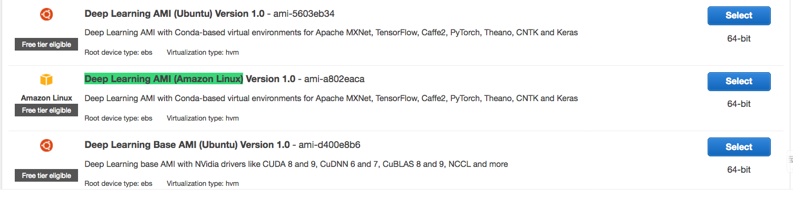

## Launch a EC2 Instance with Deep Learning AMI

1. For simplify the process of installing CUDA, MxNet, Anaconda, as well as other packages, we are going to use the `Deep Learning AMI Ubuntu` on AWS 

2. Select `p2.xlarge` instance for this purpose.

3. Select a Role which have access to `AML` and `S3` at least.

4. In security group, make sure you can `SSH` to the instance, and make sure the traffic is open on port `19999` (this is where the jupyter notebook is hosting).

5. `Review`, Select a Key, and `Launch`

## Hosting Jupyter Notebook

1. `ssh -i path/to/key.pem ubuntu@ec2-52-65-83-23.ap-southeast-2.compute.amazonaws.com`

2. Run `sudo apt update` if needed

3. `wget https://s3-ap-southeast-2.amazonaws.com/jiaxiaws/scripts/setting_notebook_with_ssl.sh` to get the script

4. Run `bash setting_notebook_with_ssl.sh`. This completes the configuration, host a notebook server at port `19999`, and set a password `pass1234`

5. a. (In your own laptop) If you are using FoxyProxy, run `ssh -i ~/your/key.pem -N -D 8157 ubuntu@ec2-52-65-83-23.ap-southeast-2.compute.amazonaws.com` Where `8157` is the local port used in FoxyProxy

   b. (In your own laptop) If not using FoxyProxy, run `ssh -i ~/.ssh/EC2.pem -N -L 19999:ec2-52-65-83-23.ap-southeast-2.compute.amazonaws.com:19999 ubuntu@ec2-52-65-83-23.ap-southeast-2.compute.amazonaws.com`
   
6. a. If FoxyProxy: open Chrome --> `https://ec2-52-65-83-23.ap-southeast-2.compute.amazonaws.com:19999` --> if any SSL errors, see 7

   b. If not FoxyProxy: open any browser --> `https://localhost:19999` --> if any SSL errors, see 7

7. (SSL error) Click on Advanced, `proceed to the address (unsafe)` or `add this address to exception`

8. Then proceed to enter password `pass1234` and `Log in`

## Open a notebook

In this case, we are going to use `Python 2` for the excercises. Open a notebook by clicking `New`.

## Excercise 1: Sample banking data on MxNet

