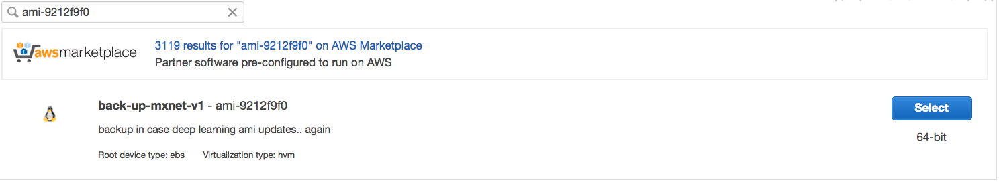

## Launch a EC2 Instance with Deep Learning AMI
1. Make sure the region is selected to `Sydney (ap-southeast-2)`

1. For simplicity installing all the dependencies, I have made an AMI for that. Select the AMI `ami-9212f9f0` in the Community AMIs


2. Select `t2.macro` instance. It is enough for this particular excercise.

3. (Optional) Select a Role.

4. Put the following `User data`:

    ```shell
    #!/bin/bash
    /bin/su - ec2-user -s /bin/bash -c "source activate mxnet_p27;jupyter notebook &"
    ```
    
4. Leave default. `Next`

4. In security group, make sure you can `SSH` to the instance, and make sure the traffic is open on port `19999` (this is where the jupyter notebook is hosting). `Next`

5. `Review`, Select a Key, and `Launch`


## Connect to the notebook
#### 1. If using FoxyProxy:

a. `ssh -i <path/to/key> -N -D <port> ec2-user@ec2-xx-xxx-xxx-xxx.ap-southeast-2.compute.amazonaws.com`

b. Then direct to the address: `https://ec2-xx-xxx-xxx-xxx.ap-southeast-2.compute.amazonaws.com:19999`

#### 2. If not using FoxyProxy:

a. Use Local Port Forwarding:

```shell
ssh  -i <path/to/key> -N -L 19999:ec2-xx-xxx-xxx-xxx.ap-southeast-2.compute.amazonaws.com:19999 ec2-user@ec2-xx-xxx-xxx-xxx.ap-southeast-2.compute.amazonaws.com
```

b. Then direct to the address: `https://localhost:19999`

#### Then input password
`pass1234`


